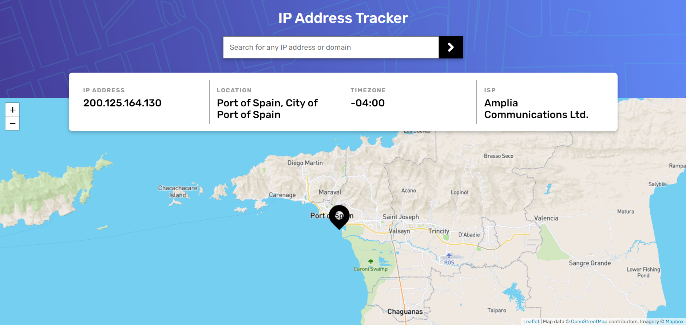

# Frontend Mentor - IP address tracker solution

This is a solution to the [IP address tracker challenge on Frontend Mentor](https://www.frontendmentor.io/challenges/ip-address-tracker-I8-0yYAH0).

## Table of contents

- [Overview](#overview)
  - [The challenge](#the-challenge)
  - [Screenshot](#screenshot)
  - [Links](#links)
- [My process](#my-process)
  - [Built with](#built-with)
  - [What I learned](#what-i-learned)
- [Author](#author)

## Overview

### The challenge

Users should be able to:

- View the optimal layout for each page depending on their device's screen size
- See hover states for all interactive elements on the page
- See their own IP address on the map on the initial page load
- Search for any IP addresses or domains and see the key information and location

### Screenshot

### Links

- Live Site URL: https://dba-fem-iptracker.netlify.app/

## My process

### Built with

- [React](https://reactjs.org/)
- [Sass](https://sass-lang.com/)
- [Mapbox](https://www.mapbox.com/)
- [Figma](https://www.figma.com/)
- [Netlify](https://www.netlify.com/)

### What I learned

This was a fun little project that allowed me to asynchronously interact with a couple of API's for each request and also learn a little about the Mapbox API, which I can see would be a useful tool.

This was my first project from the Frontend Mentor site and I particularly enjoyed working from a Figma layout as it meant I could practice receiving and realising a design as it was requested, rather than putting something together 'on the fly.' I feel that's a much more realistic workflow.

The site is hosted on Netlify and so is easy to edit and redeploy via GitHub. Deploying via Netlify also allows for the API secrets etc to be held in variables away from the client.

## Author

- Website - [Dan Bayford](https://dba-portfolio.netlify.app/)
- Frontend Mentor - [@DanB-Web](https://www.frontendmentor.io/profile/DanB-Web)
